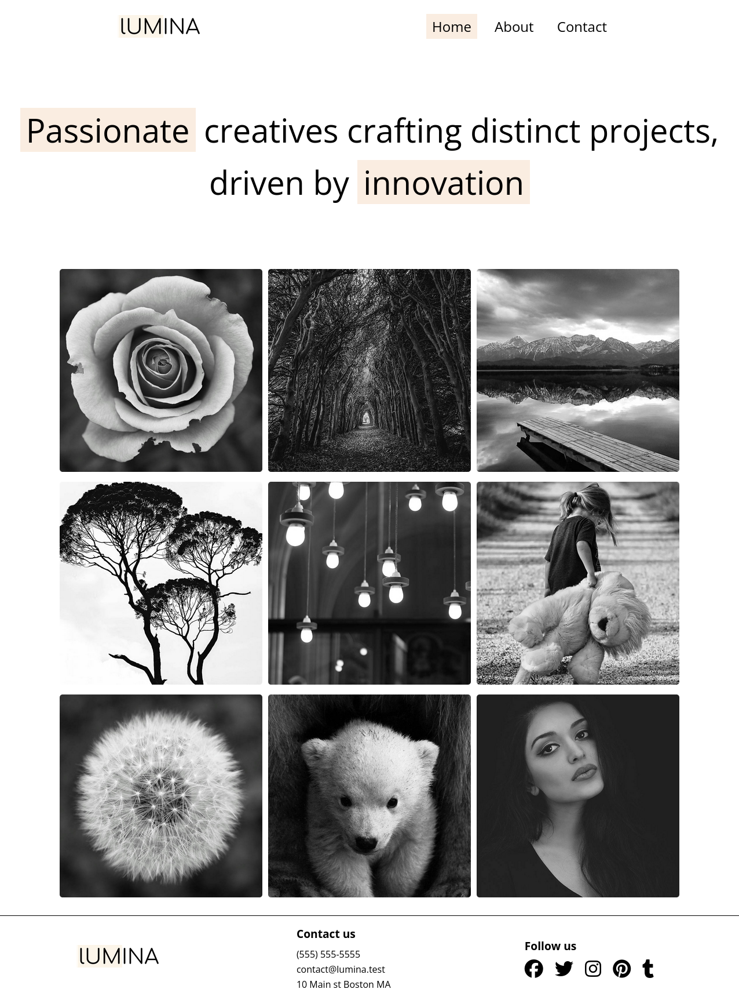
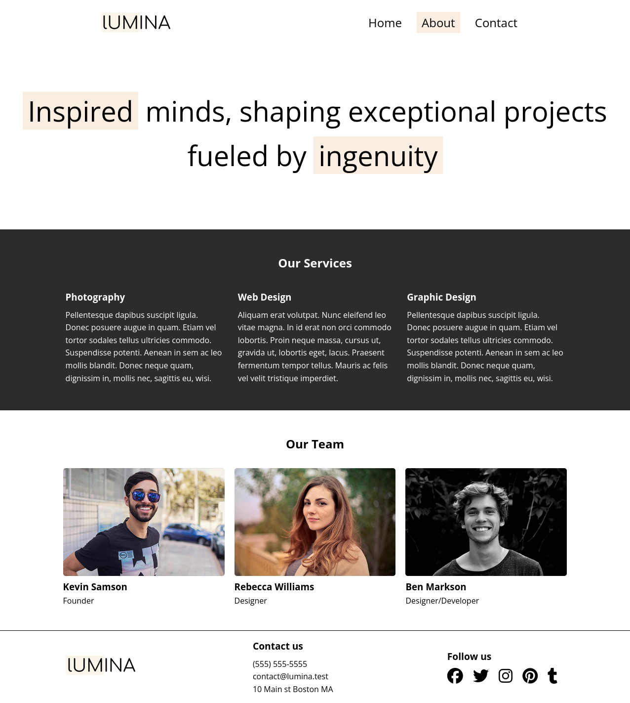
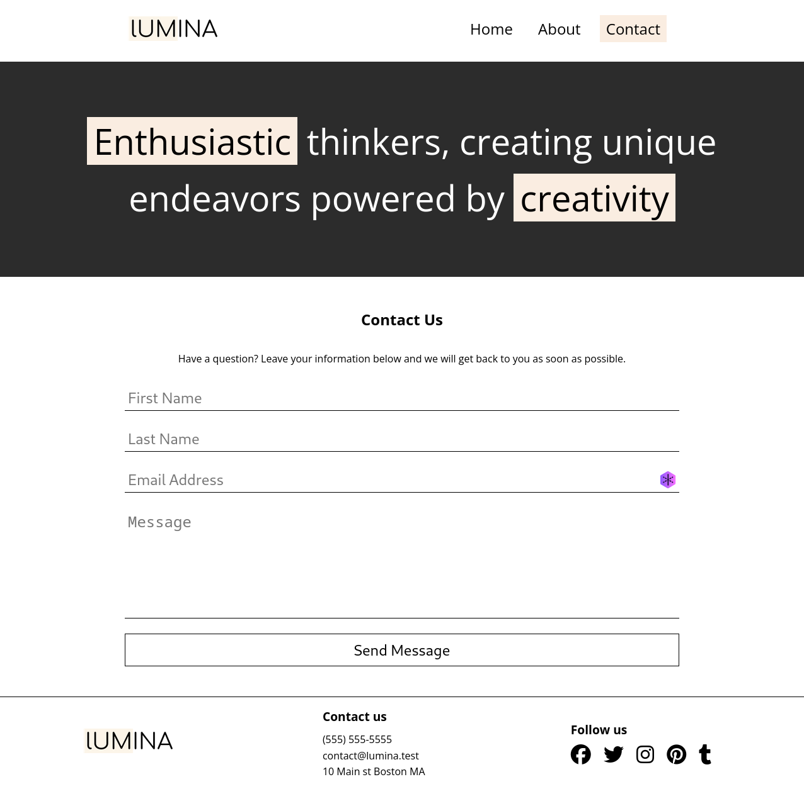

# Lumina Creative
A simple responsive website for a creative agency made with HTML/CSS.

## Features
- **Home page** with **photo gallery** powered by [Lightbox2](https://lokeshdhakar.com/projects/lightbox2/)
- **About page** with services and team section
- **Contact page** with a **contact form**
- **Responsive website**

## Screenshots

## Credits
[Brad Traversy](https://github.com/bradtraversy) **Modern HTML & CSS From The Beginning 2.0 course** on [Packtpub](https://www.packtpub.com/en-us/product/modern-html-css-from-the-beginning-20-9781835880562), [Traversy Media](https://www.traversymedia.com/modern-html-css-from-the-beginning) for project idea and needed assets to build the website.
